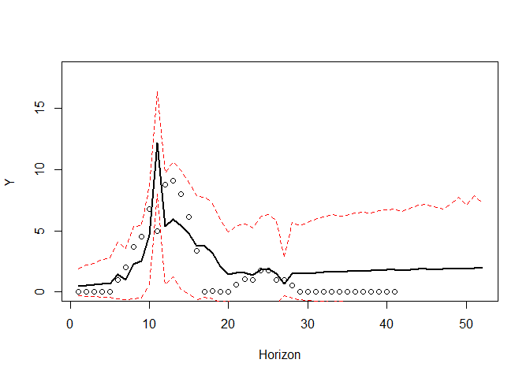

<!-- README.md is generated from README.Rmd. Please edit that file -->
# *mvforecast*: Fit, interrogate and forecast multivariate timeseries models in R

This is a work-in-progress package to fit a variety of multivariate timeseries models. At present, vector exponential smoothing models are supported and can be reconciled using temporal hierarchies. Both methods are established in the forecasting field but are little used or known by ecologists.

## Installation

You can install the development version from `GitHub` using:

``` r
install.packages("devtools")
devtools::install_github("nicholasjclark/mvforecast")
```

You can test the package's main functionality with the `test_mvforecast` function, which fits a multivariate exponential smoothing model to the NEON *Ixodes scapularis* survey timeseries that are used in the [Ecological Forecasting Initiative's 2021 Forecast Challenge](https://ecoforecast.org/efi-rcn-forecast-challenges/). Using `thief_vets`, the function then fits an equivalent model to the original series but also uses automatic univariate forecast models applied to all higher levels of temporal aggregation to gain information about long-term trends and seasonalities that would otherwise be missed when focusing only on the noisy original data. `thief_vets` uses these aggregate forecasts to reconcile the original forecast by relying on functions available in the [`thief` package](http://pkg.robjhyndman.com/thief/). Finally, the sum of the Continuous Rank Probability Score is calculated for both models against the out-of-sample test set, where a lower score is better.

``` r
library(mvforecast)
#> Loading required package: forecast
#> Registered S3 method overwritten by 'quantmod':
#>   method            from
#>   as.zoo.data.frame zoo
test_mvforecast()
#> Loading the ixodes_vets_dat dataset
#> 
#> Fitting a vets model with common seasonal smoothing and grouped level smoothing
#> Registered S3 method overwritten by 'GGally':
#>   method from   
#>   +.gg   ggplot2
#> sROC 0.1-2 loaded
#> Fitting an equivalent model that then uses hierarchical reconciliation
#> 
#> 
#> Fitting a vets model with no regressors to series with frequency 52 
#> 
#> Fitting ensemble forecasts to series at frequency 26 
#> 
#> Fitting ensemble forecasts to series at frequency 13 
#> 
#> Fitting ensemble forecasts to series at frequency 4 
#> 
#> Fitting ensemble forecasts to series at frequency 2 
#> 
#> Fitting ensemble forecasts to series at frequency 1 
#> 
#> Reconciling original forecasts
#> 
#> Plotting thief simulation forecast (lines) and true values (ytest points) for NEON plot_ID 4
```



    #> 
    #> 
    #> Calculating CRPS against ixodes_vets_dat$ytest for both models (lower is better)
    #>                     Min. X1st.Qu.    Median      Mean X3rd.Qu.     Max.
    #> vets_crps       22.27635 79.09812 103.47367 128.32740 144.5460 273.0375
    #> thief_vets_crps 12.57689 33.60623  41.01709  60.09741  76.0444 166.7946

Reconciliation is clearly a powerful technique that can drastically improve forecasts for many types of time series. In the interest of transparency and robust software engineering, a `Docker` container has been built to ensure functions in this package can be used in future if dependencies make any drastic changes. You can install the container from `Dockerhub`. For example, using `singularity` this would read as:

``` r
singularity pull docker://nicholasjclark/brms
singularity shell brms_latest.sif
R
```

Interested users can create their own containers to add further functionality or add additional libraries. The entire `Dockerfile` reads as:

``` r
FROM lcolling/r-verse-base:latest

# Use clang to compile Stan
# Using the default g++ causes memory issues
RUN apt-get update \
    && apt-get install -y --no-install-recommends \
    clang

RUN apt-get install -y --no-install-recommends libudunits2-dev
RUN apt-get install -y --no-install-recommends libgdal-dev
RUN apt-get update && apt-get install -y --no-install-recommends libv8-dev

RUN apt-get clean \
    && rm -rf /var/lib/apt/lists/*

# Create a makevars file and install rstan from source
# following the instructions at https://github.com/stan-dev/rstan/wiki/Installing-RStan-on-Linux
# Install remaining necessary R packages using specific versions (latest as of February 2021)
RUN R -e "options(repos = \
  list(CRAN = 'https://mran.revolutionanalytics.com/snapshot/2021-02-01/')); \
  dotR <- file.path(Sys.getenv('HOME'), '.R'); \
  if (!file.exists(dotR)) dir.create(dotR); \
  M <- file.path(dotR, 'Makevars'); \
  if (!file.exists(M)) file.create(M); \
  cat('\nCXX14FLAGS=-O3 -march=native -mtune=native -fPIC', \
  'CXX14=clang++', \
  file = M, sep = '\n', append = TRUE); \
  install.packages('rstan', type = 'source'); \
  install.packages('remotes'); \
  install.packages('brms'); \
  install.packages('here'); \
  install.packages('tidybayes'); \
  install.packages('xfun'); \
  install.packages('mgcv'); \
  install.packages('prophet'); \
  install.packages('pbapply'); \
  install.packages('ggplot2'); \
  install.packages('viridis'); \
  install.packages('reshape'); \
  remotes::install_github('nicholasjclark/mvforecast', dependencies = TRUE); \
  remotes::install_github('asael697/varstan@5378f428cad9560dae7f6daf8f431113f19a2019', dependencies = TRUE)"

CMD [ "R" ]
```

*This project is licensed under the terms of the GNU General Public License (GNU GPLv3)*
