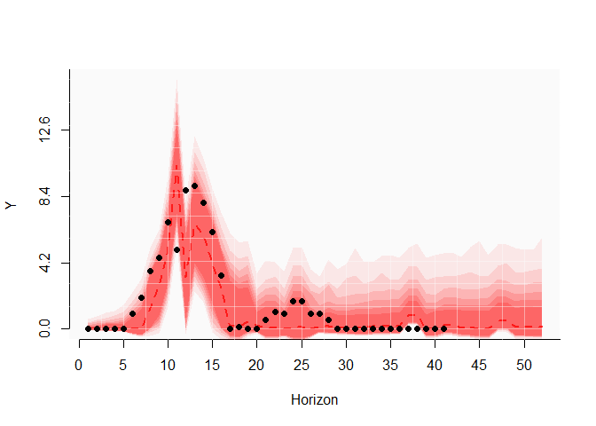

<!-- README.md is generated from README.Rmd. Please edit that file -->
# *mvforecast*: Fit, interrogate and forecast multivariate timeseries models in R

This is a work-in-progress package to fit a variety of multivariate timeseries models. At present, vector exponential smoothing models, univariate ensemble models and multivariate random forest modes are supported. All models can be reconciled using temporal hierarchies. These methods are established in the forecasting field but are little used or known by ecologists.

## Installation

You can install the development version from `GitHub` using:

``` r
install.packages("devtools")
devtools::install_github("nicholasjclark/mvforecast")
```

You can test the package's main functionality with the `test_mvforecast` function, which fits a multivariate exponential smoothing model to the NEON *Ixodes scapularis* survey timeseries that are used in the [Ecological Forecasting Initiative's 2021 Forecast Challenge](https://ecoforecast.org/efi-rcn-forecast-challenges/). Using `thief_vets`, the function then fits an equivalent model to the original series but also uses automatic univariate forecast models applied to all higher levels of temporal aggregation to gain information about long-term trends and seasonalities that would otherwise be missed when focusing only on the noisy original data. `thief_vets` uses these aggregate forecasts to reconcile the original forecast by relying on functions available in the [`thief` package](http://pkg.robjhyndman.com/thief/). Finally, the sum of the Continuous Rank Probability Score (CRPS) is calculated for both models against the out-of-sample test set, where a lower score is better.

``` r
library(mvforecast)
#> Loading required package: forecast
#> Warning: package 'forecast' was built under R version 4.0.5
#> Registered S3 method overwritten by 'quantmod':
#>   method            from
#>   as.zoo.data.frame zoo
test_mvforecast()
#> Loading the ixodes_vets_dat dataset
#> 
#> Fitting a vets model with common seasonal smoothing and grouped level smoothing
#> Registered S3 method overwritten by 'GGally':
#>   method from   
#>   +.gg   ggplot2
#> sROC 0.1-2 loaded
#> Fitting an equivalent model that then uses hierarchical reconciliation
#> 
#> 
#> Fitting a vets model with no regressors to series with frequency 52 
#> 
#> Fitting ensemble forecasts to all remaining series using 5 cores
#> 
#> Reconciling original forecasts
#> 
#> Plotting thief simulation forecast (lines) and true values (ytest points) for NEON plot_ID 4
```



    #> 
    #> 
    #> Calculating CRPS against ixodes_vets_dat$ytest for both models (lower is better)
    #>                     Min. X1st.Qu.    Median     Mean X3rd.Qu.     Max.
    #> vets_crps       22.30454 78.92754 104.64987 128.3975 141.7734 275.8718
    #> thief_vets_crps 14.94983 28.27833  40.40699  59.1694  55.7548 171.8935

We can explore how the different models produce forecast distributions by fitting each and plotting the resulting forecasts for a single plot

``` r
mod1 <- suppressWarnings(thief_rfsrc(y = ixodes_vets_dat$y_train,
                    frequency = 52,
                    k = 1))
#> 
#> Fitting a rfsrc model to series with frequency 52 
#> 
#> Fitting ensemble forecasts to all remaining series using 5 cores
#> 
#> Reconciling original forecasts

mod2 <- suppressWarnings(thief_ensemble(y = ixodes_vets_dat$y_train,
                    frequency = 52,
                    k = 1))
#> 
#> Fitting ensemble forecasts to all series using 5 cores
#> 
#> Reconciling original forecasts

mod3 <- suppressWarnings(thief_vets(y = ixodes_vets_dat$y_train,
                   multi_freq = 24,
                   level = "grouped",
                   slope = "none",
                   damped = "none",
                   seasonal = "common",
                   lambda = 0.75,
                   dependence = "equicorrelation",
                   frequency = 52,
                   cores = 6,
                   group = ixodes_vets_dat$groups,
                   save_plots = F))
#> 
#> Fitting a vets model with no regressors to series with frequency 52 
#> 
#> Fitting a vets model with no regressors to series with frequency 26 
#> 
#> Fitting ensemble forecasts to all remaining series using 6 cores
#> 
#> Reconciling original forecasts
```

``` r
site = 3
plot_mv_preds(simulation = mod1[[site]], main = 'thief_rfsrc')
points(as.vector(ixodes_vets_dat$y_test[,site]), col = 'black', pch = 16)
```


``` r
plot_mv_preds(simulation = mod2[[site]], main = 'thief_ensemble')
points(as.vector(ixodes_vets_dat$y_test[,site]), col = 'black', pch = 16)
```


``` r
plot_mv_preds(simulation = mod3[[site]], main = 'thief_vets')
points(as.vector(ixodes_vets_dat$y_test[,site]), col = 'black', pch = 16)
```


Comparison of the CRPS is straightforward

``` r
calc_crps(mod1, y_test = ixodes_vets_dat$y_test)
#>    Min. 1st Qu.  Median    Mean 3rd Qu.    Max. 
#>   9.769  31.450  34.437  46.238  51.283 144.940
calc_crps(mod2, y_test = ixodes_vets_dat$y_test)
#>    Min. 1st Qu.  Median    Mean 3rd Qu.    Max. 
#>   17.12   29.50   33.79   49.79   47.25  169.56
calc_crps(mod3, y_test = ixodes_vets_dat$y_test)
#>    Min. 1st Qu.  Median    Mean 3rd Qu.    Max. 
#>   11.24   29.93   42.04   58.50   52.12  169.86
```

Reconciliation is clearly a powerful technique that can drastically improve forecasts for many types of time series. In the interest of transparency and robust software engineering, a `Docker` container has been built to ensure functions in this package can be used in future if dependencies make any drastic changes. You can install the container from `Dockerhub`. For example, using `singularity` this would read as:

``` r
singularity pull docker://nicholasjclark/brms
singularity shell brms_latest.sif
R
```

Interested users can create their own containers to add further functionality or add additional libraries. The entire `Dockerfile` reads as:

``` r
FROM lcolling/r-verse-base:latest

# Use clang to compile Stan
# Using the default g++ causes memory issues
RUN apt-get update \
    && apt-get install -y --no-install-recommends \
    clang

RUN apt-get install -y --no-install-recommends libudunits2-dev
RUN apt-get install -y --no-install-recommends libgdal-dev
RUN apt-get update && apt-get install -y --no-install-recommends libv8-dev

RUN apt-get clean \
    && rm -rf /var/lib/apt/lists/*

# Create a makevars file and then install rstan from source
# following the instructions at https://github.com/stan-dev/rstan/wiki/Installing-RStan-on-Linux
# Install remaining R packages using specific versions (latest as of February 2021, or by indexing specific commits on Github)
RUN R -e "options(repos = \
  list(CRAN = 'https://mran.revolutionanalytics.com/snapshot/2021-02-01/')); \
  dotR <- file.path(Sys.getenv('HOME'), '.R'); \
  if (!file.exists(dotR)) dir.create(dotR); \
  M <- file.path(dotR, 'Makevars'); \
  if (!file.exists(M)) file.create(M); \
  cat('\nCXX14FLAGS=-O3 -march=native -mtune=native -fPIC', \
  'CXX14=clang++', \
  file = M, sep = '\n', append = TRUE); \
  install.packages('rstan', type = 'source'); \
  install.packages('remotes'); \
  install.packages('brms'); \
  install.packages('here'); \
  install.packages('tidybayes'); \
  install.packages('xfun'); \
  install.packages('mgcv'); \
  install.packages('prophet'); \
  install.packages('pbapply'); \
  install.packages('ggplot2'); \
  install.packages('viridis'); \
  install.packages('reshape'); \
  remotes::install_github('tsmodels/tsmethods@16601e3bd21d7293490d820137324e4f16462dbf', dependencies = TRUE); \
  remotes::install_github('tsmodels/tsaux@da46a751c619ba10184f0749ccd7d9fb9a7be31f', dependencies = TRUE); \
  remotes::install_github('tsmodels/tsets@51a26d80fdfafc41d564d08a38fe4c9776ba333f', dependencies = TRUE); \
  remotes::install_github('tsmodels/tsvets@7bea965911ddee0c585199cb380b1299e341273b', dependencies = TRUE); \
  remotes::install_github('nicholasjclark/mvforecast', dependencies = TRUE); \
  remotes::install_github('asael697/varstan@5378f428cad9560dae7f6daf8f431113f19a2019', dependencies = TRUE)"

CMD [ "R" ]
```

*This project is licensed under the terms of the GNU General Public License (GNU GPLv3)*
